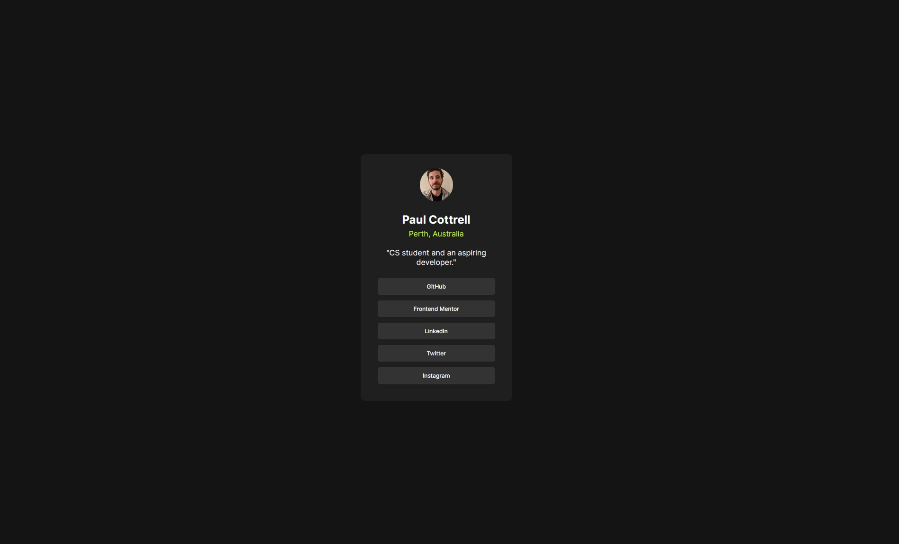

# Frontend Mentor - Social links profile solution

This is a solution to the [Social links profile challenge on Frontend Mentor](https://www.frontendmentor.io/challenges/social-links-profile-UG32l9m6dQ). Frontend Mentor challenges help you improve your coding skills by building realistic projects.

## Overview

### The challenge

Users should be able to:

- See hover and focus states for all interactive elements on the page

### Screenshot

### Links

- Solution URL: [https://github.com/p-cottrell/social-links-profile](https://github.com/p-cottrell/social-links-profile)
- Live Site URL: [https://p-cottrell.github.io/social-links-profile](https://p-cottrell.github.io/social-links-profile)

## My process

### Built with

- Semantic HTML5
- CSS custom properties
- Flexbox
- Local custom font with `@font-face`

### What I learned

This project helped reinforce the importance of using semantic HTML and how small design elements (like `border-radius` and `box-shadow`) contribute significantly to user experience. I also practiced making layouts responsive and learned to use `box-sizing: border-box` to avoid padding/layout issues.